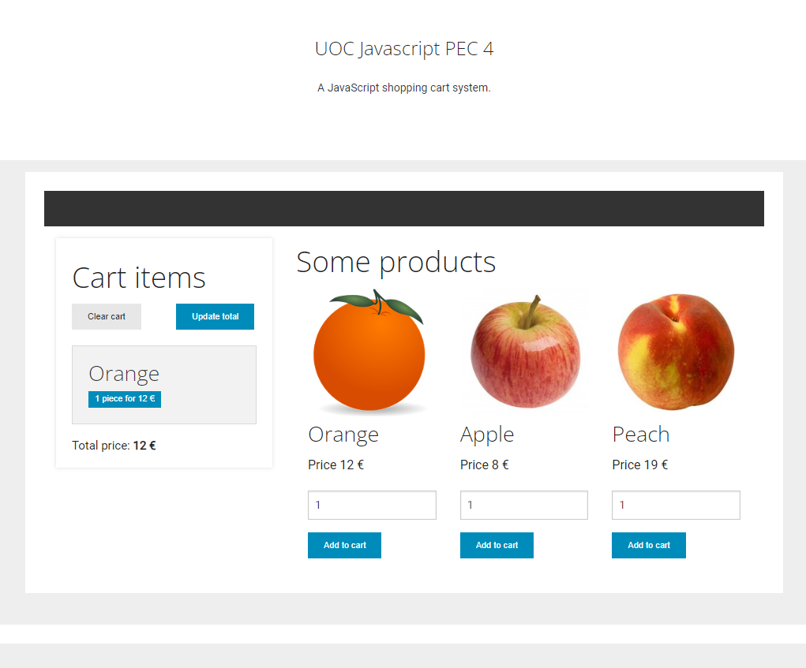

# PJP PAC 4

En aquesta PAC es practiquen els diversos aspectes que ofereix l'API DOM de JavaScript: recerca de nodes, iteració i manipulació d'elements, així com la gestió d'esdeveniments com a resposta a la interacció de l'usuari.

## Competències

En aquesta PAC es desenvolupen les següents competències del Màster:

* Que els estudiants tinguin les habilitats d'aprenentatge que els permetin continuar estudiant d'una manera que haurà de ser en gran mesura autodirigida o autònoma.
* Resoldre problemes, identificant, analitzant i definint-ne els elements significatius.
* Utilitzar de manera adequada els llenguatges de programació i les millors eines de desenvolupament per a l'anàlisi, el disseny i la implementació de llocs i aplicacions web, en funció de les necessitats del projecte.
* Aplicar, de la manera més adequada, els patrons d'arquitectura de programari més convenient per a cada problema.

## Objectius

Els objectius concrets daquesta PAC són:

* Ser capaç de comprendre i posar en pràctica les funcionalitats de manipulació del DOM de JavaScript.
* Ser capaç de resoldre problemes sobre manipulació del DOM a JavaScript.
* Saber aplicar les diferents funcions de manipulació del DOM de JavaScript.
* Explorar i conèixer maneres diferents de resoldre problemes sobre manipulació del DOM en JavaScript.

## Lliurament de la PAC

Un cop hagis realitzat les activitats pràctiques proposades en aquest enunciat, **el lliurament es realitzarà de forma doble**:

- Hauràs d'enviar els teux canvis a l'apartat de l'aula virtual de la UOC.
- Hauràs d'enviar els teus canvis al repositori de GitHub Classroom.
 
Recorda que aquest repositori l'has clonat del repositori a GitHub. Quan treballis al teu sistema, tots els canvis els faràs als teus fitxers locals, els quals hauràs d'afegir i _comitejar_ al teu repositori Git. Aquests canvis estaran al teu sistema fins que facis _push_ i els enviïs al repositori a GitHub.

Recorda que has de treballar a la branca _main_ o _master_ (la que es crei per defecte). Pots fer diversos enviaments.

A l'aula virtual trobareu una _checklist_ que us ajudarà a repassar tots els passos que heu de fer per al lliurament del vostre PAC.

## Puntuació

El fet de treballar amb tests per verificar la funcionalitat del codi us permetrà tenir una idea de la vostra pròpia nota abans del lliurament.

La puntuació dels exercicis pràctics es basa en dos criteris: **Funcionalitat** i **Implementació**. S'espera que els exercicis funcionin correctament (passin els tests) i que la implementació (el codi) tingui una qualitat adequada.

Alguns detalls a tenir en compte:

- Es penalitzarà qualsevol intent de _hardcodejar_ els tests per forçar que passin. Aquesta tècnica consisteix a canviar la implementació perquè retorni únicament el valor esperat pel test (qualsevol altre test fallaria).
- Els tests automàtics estan dissenyats per detectar exercicis erronis o incomplets per a casos concrets. El fet que un test passi no garanteix que l'exercici estigui realitzat correctament, és a dir, que cobreixi tots els casos.
- Un exercici, els tests del qual no passen, es puntuarà amb un 0 llevat que hi hagi problemes amb el test.
- A més de passar els tests, el professorat avaluarà el vostre codi en base als següents criteris:
   - Llegibilitat, senzillesa i qualitat del codi.
   - Coneixements de programació. Per exemple, no utilitzar les estructures de control adequades, com ara utilitzar un bucle per construir una sentència condicional o viceversa.

## Requisits mínims

- Tenir instal·lat Visual Studio Code.
- Coneixements bàsics de Git i GitHub (Activitats 2 i 3 del Repte 1).
- Estudi de la introducció i repàs a JavaScript (Activitat 1 del Repte 2).
- Estudi dels conceptes de JavaScript (Activitats 2 i 3 del Repte 2).
- Estudi de la introducció a l'assincronia en JavaScript (Activitat 1 del Repte 3).
- Estudi dels conceptes d'assincronia de JavaScript (Activitat 2 del Repte 3).
- Estudi dels materials i exercici sobre manipulació del DOM (Activitats 1 i 2 del Repte 4).

## Exercicis pràctics (10 p)

Per realitzar els exercicis pràctics t'has de dirigir a la següent ruta, dins del repositori: `src/pec4/pec4.js`.
En aquest fitxer hauràs d'implementar les funcions que t'indiquem als exercicis que veuràs més avall.
A cada funció trobaràs una capçalera amb la descripció de la funció i els paràmetres que rep.

D'altra banda, els tests que et permetran saber si la solució que proposes per als exercicis és correcta són al fitxer `src/pec4/pec4.test.js`.
**No heu d'editar aquest fitxer**.
Tingues en compte que els tests són condicions que han de complir les funcions que implementaràs en els exercicis, per la qual cosa et poden servir d'ajuda per corregir-los.

### Cas pràctic

En aquesta PAC treballarem amb un cas pràctic que us donem com a aplicació web. L'aplicació fa ús d'un codi HTML inicial sobre el qual cal treballar, així com una sèrie d'estils i scripts de suport que serviran per tenir una pàgina web inicial construïda per complet.

Per facilitar-te la feina, no hauràs de crear des de zero el motor de l'aplicació. En comptes d'això, hauràs de completar les funcions clau que aquest motor necessita per poder dur a terme la seva feina, així com implementar tots els elements que apliquin dinamisme a l'HTML ja donat. La resta d'elements te'ls proporcionarem ja implementats.

Aquests són els elements que et facilitem per realitzar aquesta PAC (no cal modificar-los en cap cas):
- `src/web/index.html` conté una instantània del DOM que farà servir l'aplicació. Et servirà com a guia per saber com estructurar els diferents elements i com es relacionen entre ells. El fitxer es pot obrir directament amb el navegador encara que perquè funcioni el javascript necessitaràs córrer el servidor http tal com indiquem a la secció _corrent l'aplicació_.
- `src/web/style.css` és el full d'estils que dóna format als documents HTML de l'aplicació.
- `src/web/index.js` és el mòdul JavaScript que executarà lʻaplicació.

La figura següent mostra l'aspecte que té la pàgina web que et proporcionem i sobre la qual es desenvoluparà aquesta PAC:



Com podeu observar, la pàgina web implementa una cistella de la compra bàsica. A la part esquerra es mostra el contingut de la cistella mentre que a la part dreta es mostren tres productes diferents. Per a cada producte se n'indica el nom i el preu i, a la part inferior, es pot indicar el nombre d'elements a afegir a la cistella i el botó per fer-ho.

A l'estat inicial, els botons que es mostren no tenen funcionalitat, ja que precisament aquest serà l'objectiu dels exercicis d'aquesta PAC, que veureu tot seguit.

Per veure la pàgina web del cas d'estudi en funcionament, seguiu els passos que s'indiquen a la secció _Corrent l'aplicació_.

### Preparant l'entorn

Un cop fet **clone** del repositori, has d'instal·lar les dependències del projecte.

```
npm install
```

A continuació, per llançar els tests has d'executar la següent ordre:

```
npm t
```

La instrucció anterior llançarà els tests cada vegada que deseu el fitxer `src/pec4/pec4.js`, que és precisament on implementareu els exercicis d'aquesta PAC.

Tal com t'indiquem a les anteriors PACs, la primera vegada que executis `npm t` i es llencin els tests, fallaran tots, ja que no hi ha cap exercici implementat. Tal i com vagis treballant en els exercicis i guardis el fitxer, pot ser que algun test llanci algun error. Revisa el missatge d'error que s'imprimeix per conèixer el format i entendre com es notifiquen els errors.

Si tens algun problema amb els tests, no dubtis a preguntar al fòrum "Dubtes PAC 4" de l'aula.

Tot i que la validesa del repte queda determinada pels tests unitaris, atesa la naturalesa d'aquest lliurament us facilitem un document HTML a través del qual carregar l'aplicació i verificar des del navegador que les vostres funcions es comporten com s'espera. Per comprovar-ne el funcionament.
Només has d'obrir el document index.html amb un navegador i anar prement els botons i utilitzant l'aplicació com si fos un usuari normal.

### Corrent l'aplicació

Un cop preparat l'entorn (revisa la secció anterior), podràs córrer l'aplicació web del cas d'estudi al teu ordinador. D'aquesta manera podras accedir a l'aplicació en un navegador web i comprovar que les teves funcions es comporten com s'espera. La primera vegada que executis l'aplicació, veuras que no funciona correctament, ja que no has implementat cap de les funcions que es demanen en els exercicis.

Per córrer l'aplicació hauràs d'executar la següent ordre des d'un terminal situat a l'arrel del projecte:

```
npm run serve src/
```

L'ordre anterior llança un servidor http que serveix els fitxers estàtics de la carpeta `src` del teu repositori, que és precisament on es troben els fitxers de l'aplicació web (situats a `src/web`) i el fitxer amb les solucions als exercicis (situat a `src/pec4/pec4.js`).

Un cop executada l'ordre, veuras la informació necessària per accedir a l'aplicació web des del teu navegador web. En particular, fixa't en les indicacions finals, la secció que comença amb el text `Available on:`. En aquesta secció s'indica l'URL on has d'accedir per veure l'aplicació web. A l'exemple següent, la URL és `http://127.0.0.1:8080`:`

```
Available on:
   http://127.0.0.1:8080
Hit CTRL-C to stop the server
```

Recorda que per accedir a l'aplicació web has d'afegir la ruta `web` a la URL, ja que l'ordre `serve` serveix els fitxers de la carpeta `src` i l'aplicació web és a la carpeta `src/web`. Per tant, la URL completa a què has d'accedir és `http://127.0.0.1:8080/web`. Prova d'accedir a aquesta URL i prova l'aplicació web.

Per aturar l'execució del servidor http només cal que premis les tecles `Control + C`.

---

### Exercici 1 (2 pt): Consultes al DOM

Donada la funció:
```js
function queryDOM() {...}
```

Es requereix que la funció `queryDOM` retorni un array amb els valors següents:
- A l'índex `0`, l'objecte `Element` corresponent al node del DOM amb `id` igual a `totalPrice`
- A l'índex `1`, l'objecte `NodeList` corresponent a tots els nodes del DOM el tag del qual sigui `h2`
- A l'índex `2`, l'objecte `NodeList` corresponent a tots els nodes del DOM amb la classe CSS `product`
- A l'índex `3`, l'objecte `NodeList` corresponent a tots els nodes del DOM el `tag` del qual sigui `p` i una de les seves classes CSS sigui `price`.
- A l'índex `4`, l'objecte `Element` corresponent al node del DOM de l'element `button`, de l'element amb `data-name` igual a `Peach` dins de l'element amb classe `products`.

> Nota: El tipus requerit per a cada element us pot donar una pista sobre el mètode més apropiat per efectuar la consulta.

---

### Exercici 2 (2 pts): Creació d'elements del DOM

Donada la funció:
```js
function createCartElement() {...}
```

Es requereix que la funció `createCartElement` rebi com a paràmetre una instància de la classe `item`, que té aquesta estructura:

```javascript
{
     name: "string";
     units: "int";
     price: "int";
}
```

i retorni un element del DOM corresponent al codi HTML següent:

```html
<div class="panel"><h3>{name}</h3><span class="label">{units} piece for {price} €</span></div>
```

Essent `{name}`, `{price}` i `{units}` els valors emmagatzemats a les propietats del mateix nom del paràmetre `item`.

> Nota: Fixa't que la classe `item` ja està definida dins del fitxer `pec4.js`.

### Exercici 3 (1 pts): Eliminació d'elements del DOM

Donada la funció:

```js
function emptyCart() {...}
```

Es requereix la seva implementació, de manera que en invocar-la, es recorrin tots els `Element` amb classe `panel` continguts dins de l'element del DOM amb identificador `cartItems` i s'eliminin (quedant, així, la cistella de l'aplicació buida).

### Exercici 4 (1 pts): Actualització d'elements del DOM

Donada la funció:

```js
function updateCartTotal() {...}
```

Es requereix la seva implementació, de manera que en invocar-la s'actualitzi el valor de l'element del DOM amb identificador `totalPrice`, sent el seu valor el resultat de la suma dels preus dels productes de classe llistats dins de l'element del DOM amb identificador `cartItems`.

> Nota: El preu dels elements de la cistella està dins d'un _string_ que hauràs de tractar prèviament.

### Exercici 5 (2 pts): Addició d'elements al DOM

Donada la funció:

```js
function addToCart(item) {...}
```

Cal fer-ne la implementació. La funció haurà de comptar amb les característiques següents:
  - Haurà de rebre com a paràmetre un objecte de tipus `item`, que serà l'element que caldrà afegir a la cistella.
  - Per a això primer haurà de comprovar si aquest producte ja existeix a la cistella, utilitzant l'atribut `name` de l'item rebut com a paràmetre, i el valor de l'element `h3` del producte. Els productes seran cadascun dels elements amb classe `panel` que estiguin dins de l'element amb identificador `cartItems`.
  - Si l'objecte existeix, s'haurà d'actualitzar el seu nombre d'elements a la cistella, d'acord amb el valor que existeixi i amb el valor de l'atribut `units` de l'item.
  - Si l'objecte no existeix, cal afegir-lo a la cistella. Per construir l'element del DOM s'haurà de fer servir la funció `createCartElement(item)` definida a l'exercici 2. Aquest element nou haurà d'incorporar-se al llistat d'elements, identificat per `cartItems`.
  - Els missatges relacionats amb el nombre d'elements de la cistella han de continuar sent vàlids. És a dir, si el preu de l'element és X€, i hi ha N unitats, el preu a mostrar serà N*X.

> Nota: Fixa't bé en el fitxer `index.html` per veure com s'estructura la cistella de la compra.

### Exercici 6 (2 pts): Event Listeners

Donada la funció:

```js
function addListeners() {...}
```

Cal enllaçar les funcions implementades als exercicis anteriors amb esdeveniments en els botons de l'aplicació. En concret s'hauran d'implementar 3 _event listeners_:
  - Un _event listener_ que, en fer clic a l'element amb identificador `clear`, cridi a la funció `emptyCart()`.
  - Un _event listener_ que, en fer clic al botó amb identificador `update`, cridi a la funció `updateCartTotal()`.
  - Un _event listener_ que, en fer clic a qualsevol dels botons de add to cart (elements de tipus `button` dins d'elements amb classe `product`), facin les següents accions:
    - Crear un objecte de tipus `item`, amb el nom, preu i unitats que hi ha a l'element input associat.
    - Trucar a la funció `addToCart()` fent servir com a paràmetre aquest item.
